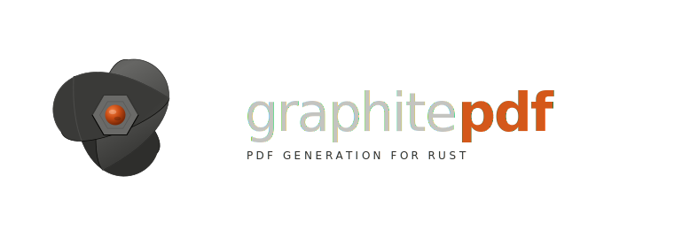

<p align="center">
  
</p>

<p align="center">
  <strong>A modern brand system for GraphitePDF — a Rust-native PDF rendering engine focused on precision, performance, and visual clarity.</strong>
</p>

<p align="center">
  
  
  
</p>

---

## Overview

GraphitePDF is designed to feel like a serious systems tool:

- precise without feeling sterile
- modern without visual excess
- expressive while remaining documentation-first
- unmistakably Rust-native in tone and craftsmanship

The visual language combines deep graphite neutrals, focused rust-orange accents, and geometric composition built for technical products and developer tooling.

---

## Color System

<p>
  
  
  
  
</p>

<p>
  
  
  
  
</p>

---

## Repository Structure

| Area | Files | Purpose |
| --- | --- | --- |
| Brand guidelines | `design-palette.md`, `visual-identity.md` | Defines composition, tone, spacing, and visual usage principles |
| Design tokens | `tokens.json`, `tokens.yaml`, `colors.css` | Shared color and typography primitives across tooling |
| Logo system | `logo/graphitepdf-logo-oss.svg`, `mark/graphitepdf-mark.svg` | Primary wordmark and compact brand mark |
| Product assets | `icon/graphitepdf-favicon.svg`, `icon/graphitepdf-app-icon.svg` | Optimized assets for browsers, apps, and small surfaces |

---

## Recommended Usage

| Use case | Recommended asset |
| --- | --- |
| README headers and documentation landing pages | `logo/graphitepdf-logo-oss.svg` |
| Avatars, favicons, compact placements | `mark/graphitepdf-mark.svg` |
| UI styling and implementation | `colors.css`, `tokens.json`, `tokens.yaml` |
| Marketing surfaces and future websites | Full token system and visual identity guides |

---

## Design Principles

GraphitePDF visuals should consistently communicate:

- reliability
- technical precision
- systems-level craftsmanship
- modern open-source quality

Preferred direction:

- let graphite neutrals dominate layouts
- use rust-orange intentionally as a focal accent
- prioritize spacing, structure, and strong contrast
- keep visuals geometric, minimal, and documentation-oriented

---

## Quick Start

```text
Primary logo:      brand/logo/graphitepdf-logo-oss.svg
Standalone mark:   brand/mark/graphitepdf-mark.svg
Palette tokens:    brand/tokens.json
CSS variables:     brand/colors.css
Usage guidelines:  brand/visual-identity.md